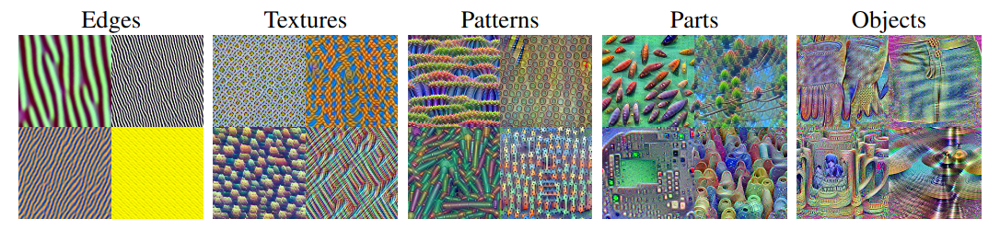

# ViT Activation Maximisation
Fork of [Ghiasi & Kazemi](https://arxiv.org/abs/2212.06727)'s code for finding images that maximise certain signals in a Vision Transformer (ViT) using gradient ascent to improve all patch vectors simultaneously.

My version fixes all missing dependencies (both requirements from PyPi as well as submodules from GitHub) and makes the source code itself installable as a submodule in a bigger project (which isn't possible in the original repo due its absolute imports).

## Installation
### Approach A: Editable install
This will make the source code available for importing in any script on the system via `import vit_actmax`. In the directory you keep other GitHub-sourced packages, do:
```
git clone --recurse-submodules https://github.com/GitMew/ViT-ActMax.git
cd ViT-ActMax
pip install -e .
```
Running the experiments in this repo requires this form of installation.

### Approach B: Submodule
Alternatively, if you *don't* want to expose this code to all projects but still want to use it, it can also be installed as a Git submodule. In your new (Git-tracked) project, do:
```
mkdir lib
cd lib
mkdir submodules
cd submodules

git add submodule https://github.com/GitMew/ViT-ActMax.git
cd ViT-ActMax
git submodule update --init --recursive

cd ..
cd ..
ln -s submodules/ViT-ActMax/src/vit_actmax vit_actmax
```
On Windows, replace `ln -s` by `mklink /d` and swap the two paths. (This only works in `cmd` launched in administrator mode; Powershell syntax is more obscure.)

What the above code does, in short, is to first make a place to store both a the repo code as well as its endpoint, then add it as a submodule *and* update its own submodules, and finally add a symlink that bridges the gap between `lib` and `src`. In your new project, you can now import this code with `import lib.vit_actmax`.

## Running experiments
After an editable install, test whether your GPU can handle the heat by running
```
python experiments/it15/vis35.py --network 35 --method "in_feat" --layer 4 --feature 20 -v 0.1
```
What these parameters mean:
- `network`: pretrained network identifier. Ranges from 0 to 99. Model 35 corresponds to ViT-B/32.
   - To get the list of networks, see the list below or run the `show_models.py` script.
- `method`: what to maximise. Can be one of:
   - `in_feat`: activation of a hidden neurons in an MLP.
   - `out_feat`: activation at an output of an MLP.
   - `keys`, `queries`, `values`: has to do with attention.
- `layer`: layer of the maximised feature, ranging from 0 to 11 (ViT/B has 12 layers).
- `feature`: index of the maximised feature.
   - `in_feat`: ranging from 0 to 3071 (ViT/B has MLPs with a hidden layer of 3072 neurons).
- `v`: regularisation constant.

---

# Original README:
## What do Vision Transformers Learn? A Visual Exploration


### ViT Models:
To visualize the features of the ViT models:
```python
PYTHONPATH=. python experiments/it15/vis35.py -l <layer_number> -f <feature_number> -n  <network_number> -v <tv_coefficient>
```
For example: 
```python
PYTHONPATH=. python experiments/it15/vis35.py -l 4 -f 20 -n  35 -v 0.1
```

### Clip Models:   
To visualize the features of the CLIP models:
```python
PYTHONPATH=. python experiments/it15/vis98.py -l <layer_number> -f <feature_number> -n  <network_number> -v <tv_coefficient>
```
For example: 
```python
PYTHONPATH=. python experiments/it15/vis98.py -l 4 -f 20 -n  98 -v 0.1
```
For the ViT models the `-n` option should be in `[34, 35, 36, 37, 38, 39]`, 
and for the CLIP models the `-n` option should be in `[94, 95, 96, 97, 98, 99]`

To list all the available network numbers use:
```python3
python show_models.py
```
Here we list some of them:
- 34:     ViT0_B_16_imagenet1k
- 35:     ViT1_B_32_imagenet1k
- 36:     ViT2_L_16_imagenet1k
- 37:     ViT3_L_32_imagenet1k
- 38:     ViT4_B_16
- 39:     ViT5_B_32
- 94:     CLIP0_RN50
- 95:     CLIP1_RN101
- 96:     CLIP2_RN50x4
- 97:     CLIP3_RN50x16
- 98:     CLIP4_ViT-B/32
- 99:     CLIP5_ViT-B/16

We use the `timm` library to load the pretrained models.
After running these commands, you can find the visualizations in the `desktop` folder.


Other experiments done in the paper can be found in the `experiments` folder.

For the experiments that we need to load the imagenet dataset like the isolating CLS experiment, the code 
assumes that the dataset is in data/imagenet/train for the training set, and data/imagenet/val for the validation set.

We will update the readme with more instructions on how to run other experiments soon.
